# STADEN — desktop QA

Datum: 2026-08-23  
Omfattning: publik app och `/admin` vid 1024×768, 1280×720, 1440×900 och 1920×1080.

## Resultat

Desktopupplevelsen är visuellt sammanhållen och har ingen observerad dokumentöverflow i de publika vyerna. Hem, Kultur, Nöje och Mat behåller den fullbreda, redaktionella museikänslan. Profil och admin fungerar som separata arbetsytor med tydlig hierarki.

Två konkreta laptopfel upptäcktes:

1. Adminöversiktens tvåkolumnsrubrik gjorde dokumentet 56 px bredare än viewporten vid 1024 px.
2. Redigerarens stora rubrik kolliderade visuellt med status- och publiceringskontrollerna vid 1024–1280 px.

Båda är korrigerade genom att adminrubrikerna staplas från 900 till 1439 px och först går sida vid sida från 1440 px. Kontrollerna har dessutom en säker maxbredd.

## Viktiga åtgärder

- Adminrubriker och editor-actions har robusta laptop-breakpoints utan `overflow: clip` som maskering.
- Profilens hero använder viewport-anpassad minhöjd, så listskapande och sparat innehåll kommer närmare första skärmen på korta laptops.
- Formuläret för ny lista har maxbredd 680 px på desktop.
- `Spara utkast` kan inte längre publicera ett inlägg. Publicering sker enbart via den uttryckliga knappen `Publicera`.
- Den felaktiga texten om automatisk lagring har ersatts med korrekt instruktion.
- Sökfält och select-kontroller har höjts till 16 px funktionell text på desktop.
- Desktopnavigationen har tydligare textstorlek och ingen dubbel länkmarkering.
- Fokus för Nöjes expanderbara rader och reduced-motion för careten är kompletterade.
- Den tidigare inerta kanalväljaren visas nu ärligt som läsläge tills databasschemat stöder flera kanaler.
- Profilsammanfattningen använder korrekt singular och plural för sparade objekt och listor.

## Visuell evidens

### Publik desktop

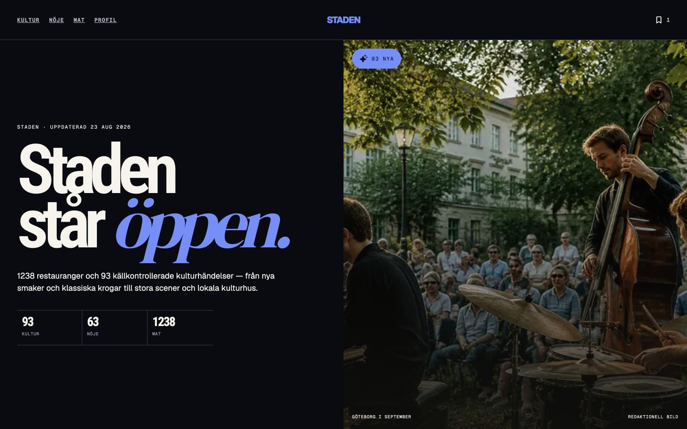

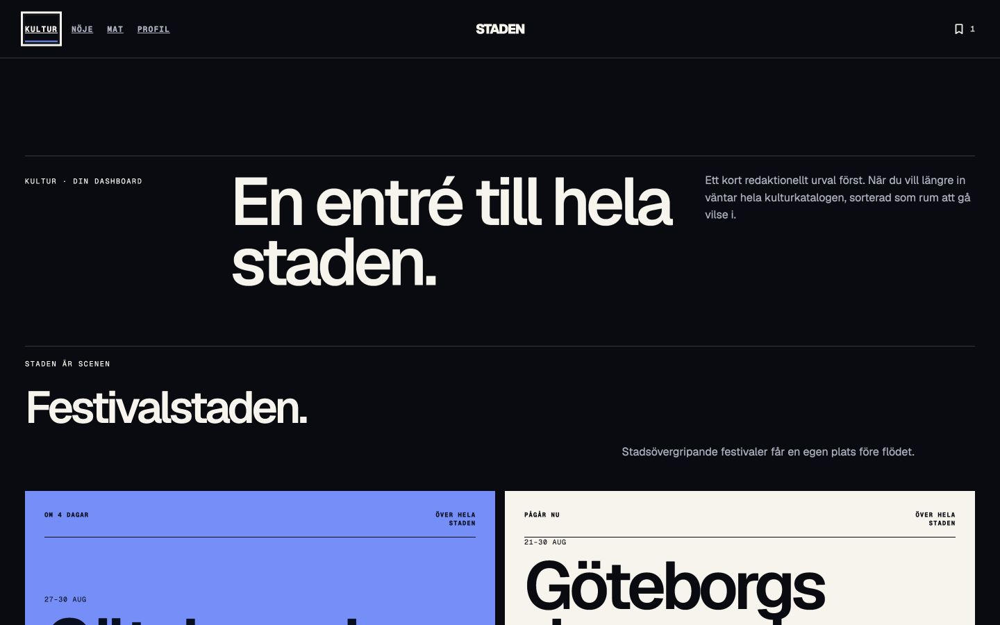

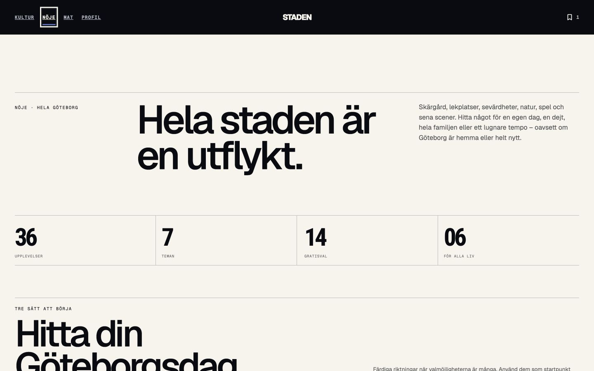

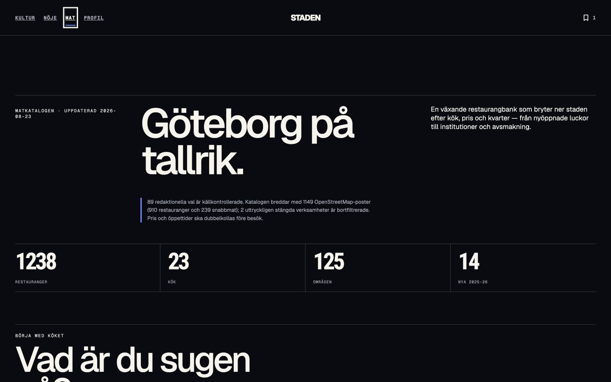

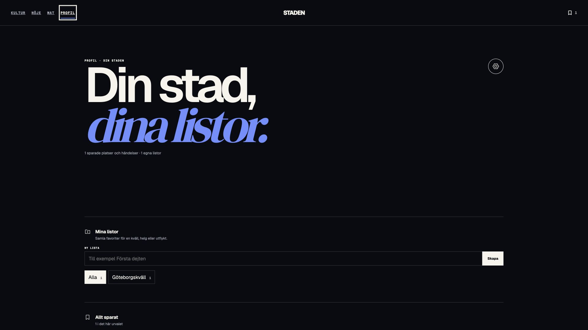

### Admin

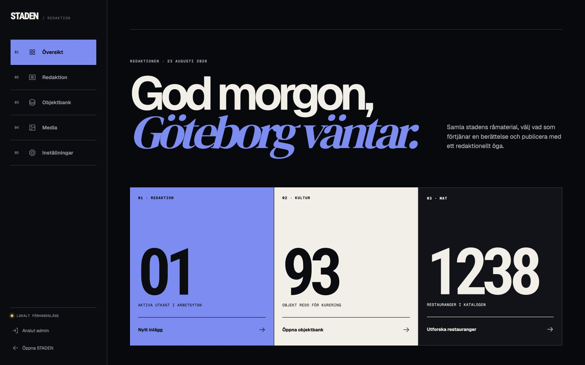

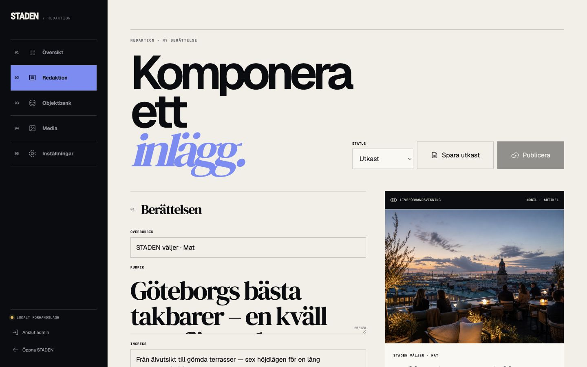

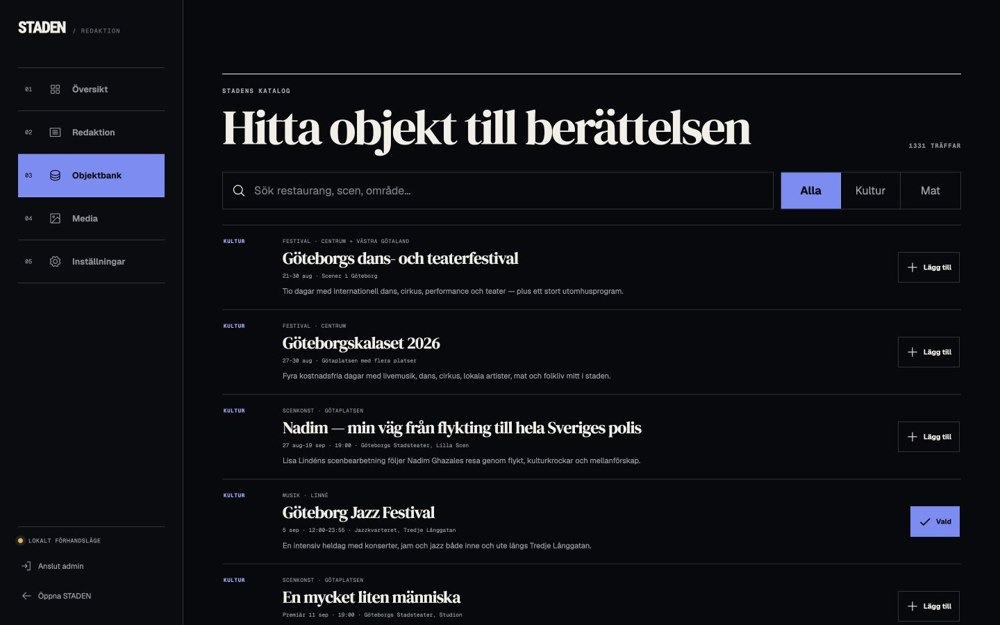

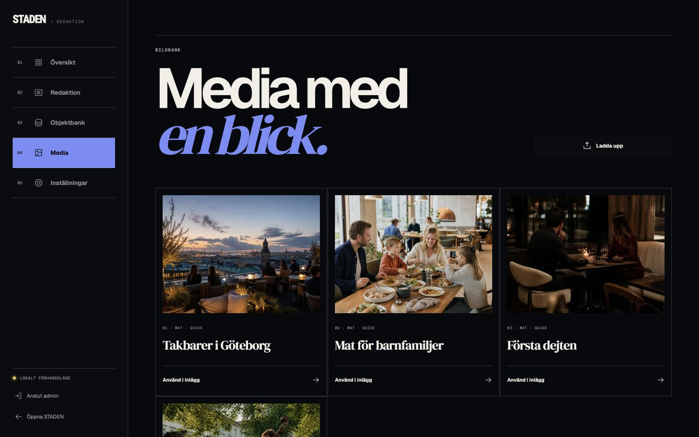

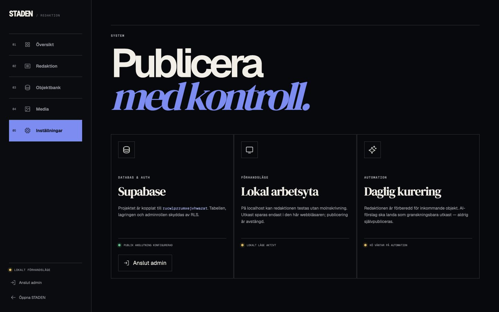

### Fyndbild före korrigering

Följande bild visar den tidigare kollisionen vid 1024×768. Den används som felbevis; korrigeringen efter denna capture är verifierad genom breakpointanalys, lint och produktionsbuild.

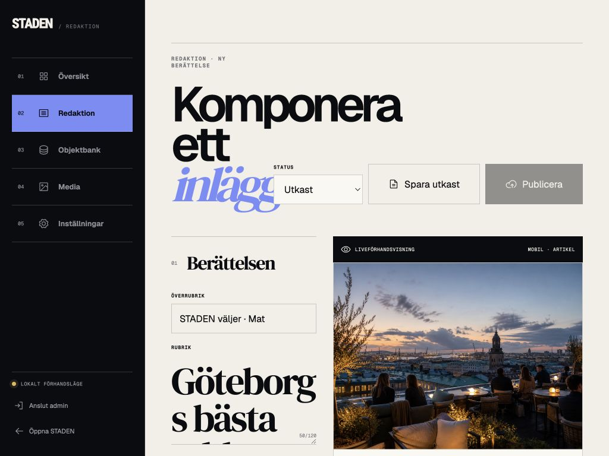

## Kvarvarande förbättringar

- Flera publiceringskanaler behöver en separat Supabase-migration innan kanalväljaren kan aktiveras igen.
- Objektbanken visar högst 18 objekt och behöver paginering eller `Visa fler` när katalogen växer.
- SPA-navigationen annonserar vybyte men skulle på sikt vinna på en gemensam skip-link och dokumenterad fokusstrategi.
- Den fullbreda layouten vid 1920 px är medvetet redaktionell. Ett maxbreddsshell kan A/B-testas senare, men införs inte som en QA-fix eftersom det ändrar den valda identiteten.

## Verifiering

- `npm run lint` — godkänd.
- `npm run build` — godkänd med statisk generering av `/` och `/admin`.
- Lokala produktionsrutter `/` och `/admin` — HTTP 200.
- Publika mätningar — ingen horisontell dokumentoverflow vid 1024, 1280, 1440 eller 1920 px.
- Admin — före korrigering hade endast översikten en 56 px overflow vid 1024 px; editor-kroppen i övrigt låg inom viewporten.
- Två oberoende agentgranskningar och en slutdomare — godkänd, inga kvarvarande P0–P2.

## Evidensgräns

Kontrollen är en desktop-webbgranskning, inte en full WCAG-revision. Den omfattar inte fysisk Windows-hårdvara, alla browser-/zoomkombinationer, skärmläsare eller autentiserad publicering mot produktionsdata. Supabase har inte muterats i denna QA-runda.
