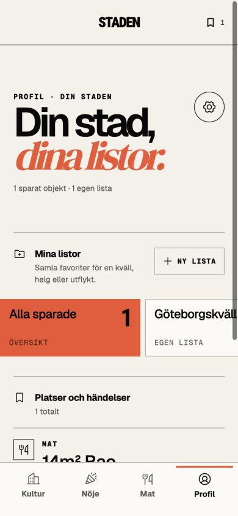
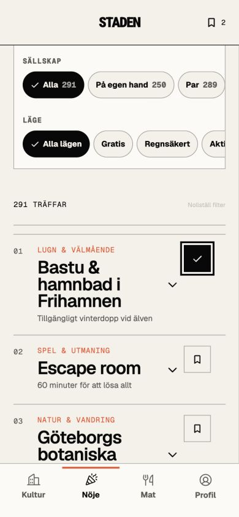
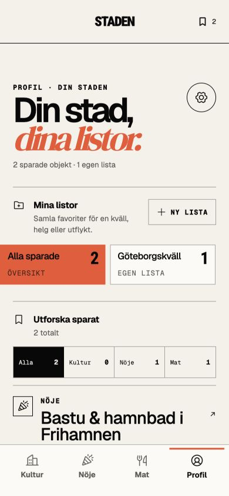
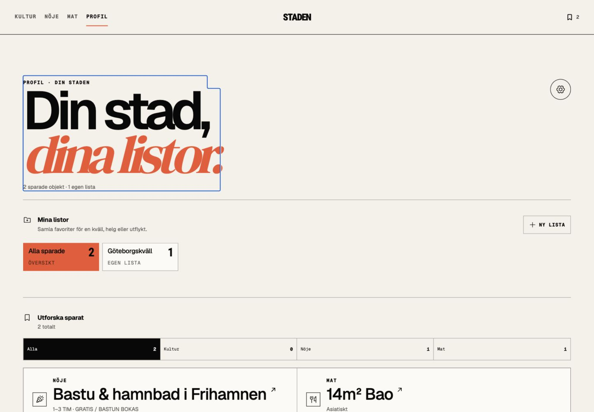
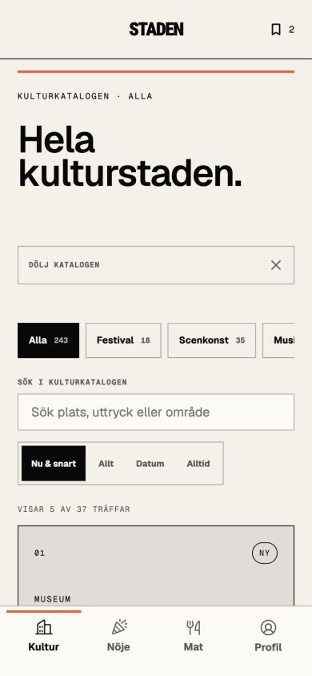
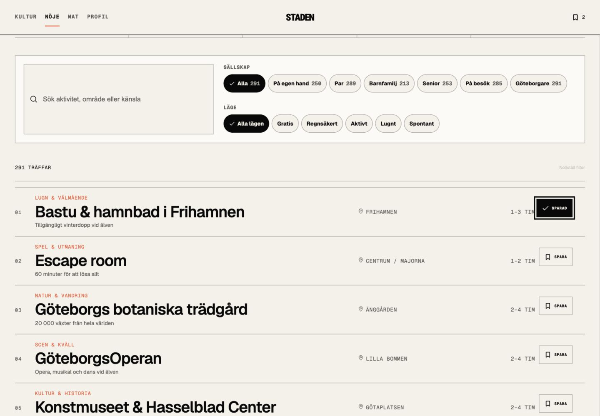

# STADEN — UX-audit av sparat flöde

## 1. Baslinje

**Hälsa: Behövde förenklas**

- Profil prioriterade listadministration framför det sparade innehållet.
- Listkort var stora på mobil och gjorde översikten långsam att skanna.
- Nöjeskatalogens permanenta upplevelser saknade en egen sparfunktion.
- Kultur saknade en direkt väg till sådant som går att göra omedelbart.

## 2. Gemensamt sparflöde

**Hälsa: Stark**

- Kulturhändelser, nöjesupplevelser och restauranger kan nu sparas.
- Samma status syns i toppens räknare och i Profil.
- Sparade nöjesobjekt får källänk, karta och metadata i samma modell som Kultur och Mat.

## 3. Förenklad Profil

**Hälsa: Stark**

- Listväxlaren är kompaktare och visar antal direkt.
- `Alla`, `Kultur`, `Nöje` och `Mat` ger en snabb innehållsfiltrering.
- Objektets titel och karta är primära vägar vidare.
- Flytt och borttagning ligger under `Hantera`, så administration inte konkurrerar med utforskandet.

## 4. Kultur: Nu & snart

**Hälsa: Stark**

- Dashboarden har en tydlig genväg till dagens och morgondagens val.
- Samma val finns som tidsfilter i kulturkatalogen.
- Resultatantalet uppdateras och katalogen öppnas direkt med filtret aktivt.

## 5. Verifiering

**Hälsa: Godkänd**

- Mobil: 390 × 844.
- Desktop: 1440 × 1000.
- Sparning, borttagning, typfilter, listfilter, externa objektlänkar och kartlänkar kontrollerade i appen.
- `npm run lint` och `npm run build` passerar.

