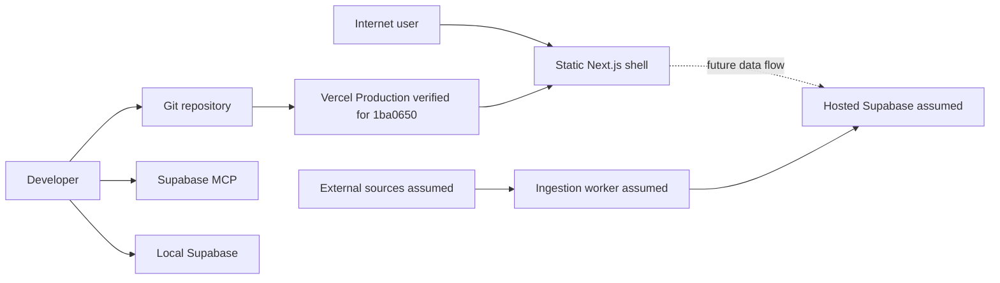

# STADEN — provisorisk hotmodell

**Status:** PROVISIONAL, ej kontextvaliderad

**Scopeankare:** Git-basrevision `bef8cd8` (`main`), säkerhetshärdning till och med `861a561` samt Next.js-apprevision `1ba0650`, analyserat 2026-08-23

**Metod:** repo-grounded abuse paths; antagna framtida komponenter markeras uttryckligen.

## Executive summary

Repot innehåller ett körbart, statiskt Next.js 16.3.2-skal men ingen databasmodell, Auth-, API- eller ingestionkod. Den evidensbaserade runtime-ytan är därför liten: en presentationssida, statiska resurser och bygg-/dependencykedjan. Apprevision `1ba0650` har passerat Vercel Production och GitHubs hosted CodeQL/dependency/secret/buildgrind; den stabila aliasen svarar med avsedda headers. De högsta riskerna är fortfarande villkorade inför den databurna produkten: felaktig Supabase-auktorisering/RLS, läckta privilegierade nycklar, förgiftning eller SSRF i framtida datainhämtning samt dataförlust utan verifierad restore. Nuvarande säkerhetsarbete är en leveransbaslinje, inte ett fullständigt produktionsgodkännande.

## Scope and assumptions

**In scope:** basrevisionen, säkerhetsdeltat (`README.md`, `.gitignore`, `.github/`, `SECURITY.md`, `docs/security/` och härdningar i `.mcp.json`/`supabase/config.toml`) samt `package*.json`, `next.config.ts`, `tsconfig.json`, `eslint.config.mjs` och webbskalet i `src/app/`; Git/Vercel-byggkedjan som kritiskt utvecklingsflöde; villkorade risker direkt motiverade av den planerade stadsappen och Supabase-integrationen.

**Out of scope:** genererade `.next/`/`node_modules/`, leverantörernas interna plattformar, den separata äldre Viyo-koden, social engineering/fysisk säkerhet, destruktiv testning och varje endpoint eller produktionstjänst som inte finns dokumenterad i repot.

Väsentliga antaganden som ännu inte har validerats:

- STADEN blir en publik webb-/mobilklient med konton, sparade listor och eventuellt platsbaserad personalisering.
- Supabase blir system of record för Postgres/Auth/Storage och nås från en publik klient via anon-identitet, medan service role endast används i betrodda serverjobb.
- Automatiserade jobb hämtar tredjepartsdata och media från kommunala, kulturella och kommersiella källor 1–2 gånger per dag.
- Vercel Production och `https://staden.vercel.app` är verifierade för apprevision `1ba0650`; team/project settings, custom domain, miljövariabler, WAF/loggar och rollback-retention är fortfarande okända.
- Personuppgifter kan omfatta konto, sparade listor och plats-/livsstilsinferenser; exakt dataklassning och retention är okänd.

Open questions that materially change ranking:

1. Vilka miljöer, driftplattformar och internetexponerade endpoints finns, och vilka delar körs med service role?
2. Vilka authN/authZ-regler, administratörsroller, RLS-policyer, användarantal och personuppgiftskategorier gäller?
3. Vilka datakällor/URL:er hämtas automatiskt, får användare eller redaktörer påverka dem, och lagras externa bilder/filer?

## System model

### Primary components

- **Supabase local configuration:** `supabase/config.toml` aktiverar lokalt Data API, Auth och Edge Runtime samt exponerar `public` och `graphql_public`. Detta är utvecklingskonfiguration, inte bevis för hosted state.
- **Supabase MCP developer integration:** `.mcp.json` pekar på ett project-scoped Supabase MCP-endpoint med `read_only=true` och begränsad funktionslista. Autentisering, tokenlagring och faktisk serverbehörighet finns inte i repot.
- **Next.js presentation shell:** `src/app/` innehåller en server-renderad/statisk startsida, metadata, CSS och ikon. `package.json`/`package-lock.json` låser Next.js 16.3.2, React 19.2.8 och byggverktygen. Det finns inga Client Components, Route Handlers, Server Actions, formulär, Supabase-importer, `fetch`-anrop eller användarkontrollerad rendering.
- **Web response configuration:** `next.config.ts` stänger versionsheadern och sätter `nosniff`, frame denial, referrer policy och en restriktiv Permissions Policy för hela appen.
- **Git repository:** bär applikationskälla, låsta beroenden, konfiguration, säkerhetsworkflows och säkerhetsdokumentation. Migrationer, serverfunktioner och containerdefinition saknas.
- **Future data client/ingestion:** antagna komponenter baserade på produktbriefen; inga repoankare finns ännu och de får inte betraktas som implementerade kontroller eller entrypoints.

### Data flows and trust boundaries

- **Internet user → Vercel → Next.js presentation shell:** `https://staden.vercel.app` levererar en statisk, icke-autentiserad sida och dess resurser över HTTPS. Nuvarande interaktioner är lokala ankarlänkar och inerta knappar; ingen användardata skickas eller lagras. HTTP 200, HSTS och appheaders är observerade; WAF-/bot-/loggkonfiguration ligger utanför repoevidensen.
- **Developer workstation → Git repository → Vercel build:** källkod och låsta beroenden via Git; `next build` är den definierade byggvägen. Install/build passerar npm-registret/transitiva beroenden och `next/font/google` är en extern byggtidsgräns. Branchregler, deploy-identitet, miljöskydd, artifact provenance och faktisk Vercel-konfiguration är okända.
- **Developer MCP client → Supabase MCP endpoint:** project ref och OAuth/sessionuppgifter över HTTPS; `.mcp.json` visar endpoint men inte credential storage, scope, rate limiting eller server-side authorization. Project ref är identifierare, inte hemlighet.
- **Supabase CLI/local services → local database/Auth/API:** TOML-konfiguration och lokala HTTP/Postgres-portar; `api.max_rows = 1000`, Auth-rate limits och refresh-tokenrotation finns i `supabase/config.toml`. Lokal API TLS och DB network restrictions är avstängda; detta är rimliga localhost-defaults men olämpliga som produktionsbevis.
- **Future data-enabled client → future app/Supabase:** antagna konton, sökningar, listor och positionsdata över HTTPS. AuthN, RLS, schema validation, origin controls och abuse limits är okända eftersom dessa flöden och migrationer saknas.
- **Future ingestion worker → third-party sources → Supabase:** antagna event-, plats-, text-, URL- och mediedata över HTTPS. Allowlists, URL-normalisering, filgränser, licensverifiering och idempotens är okända eftersom worker saknas.
- **Security CI → GitHub:** pinnade scanner-actions med read-only standardbehörighet och villkorade jobb finns. Appmanifestet gör CodeQL/SCA-jobben tillämpliga i nästa hosted körning. Deploy credentials, OIDC, environment protection och artifact provenance är fortfarande okända.

#### Diagram

## Assets and security objectives

| Asset | Why it matters | Security objective (C/I/A) |
|---|---|---|
| Supabase privileged credentials | Service-role/adminåtkomst kan kringgå klientpolicyer och exponera eller ändra all data | C, I |
| User identity/session data (assumed) | Kapade sessioner möjliggör kontoövertagande; auth-data är personuppgift | C, I, A |
| Saved lists and location/lifestyle signals (assumed) | Kan avslöja vanor, intressen, familjesituation och rörelsemönster | C, I |
| Places, events and editorial state (assumed) | Felaktig eller manipulerad information kan styra användare fel och skada förtroende | I, A |
| Media objects and licenses (assumed) | Olagligt, skadligt eller publikt exponerat innehåll skapar rättighets- och användarrisk | C, I, A |
| Database schema, RLS and migrations | Är säkerhetsgränsen för en direktnåbar Supabase-klient och krävs för reproducerbar restore | I, A |
| Source and build/deploy artifacts | Supply-chain-kompromiss kan påverka alla användare och läcka miljöhemligheter | I, A |
| Audit and recovery evidence | Behövs för detektion, incidentutredning och bevisad återställning | I, A |

## Attacker model

### Capabilities

- En oautentiserad internetangripare antas kunna automatisera publika klient/API-anrop, manipulera parametrar och skapa många konton när tjänsten lanserats.
- En autentiserad lågprivilegierad användare antas kunna ändra klientkod/anrop och försöka läsa eller skriva andra användares objekt.
- En angripare kan kontrollera eller kompromettera en extern URL/källa som framtida ingestion hämtar, eller bidra med vilseledande publikt innehåll.
- En supply-chain-angripare kan försöka introducera skadligt beroende, workflow eller läckt deploy credential via bidrag eller komprometterat utvecklarkonto.

### Non-capabilities

- En publik webb-URL kan bekräftas, men ingen app-till-databasåtkomst kan bekräftas; modellen påstår därför inte att de databurna angreppen är möjliga idag.
- Angriparen antas inte ha fysisk åtkomst till leverantörsdatacenter eller kunna bryta korrekt TLS/kryptografi.
- Intern malicious admin, leverantörskompromiss och stulen utvecklarenhet modelleras endast som residual/supply-chain-risk tills behörighetsmodellen är känd.

## Entry points and attack surfaces

| Surface | How reached | Trust boundary | Notes | Evidence (repo path / symbol) |
|---|---|---|---|---|
| Next.js-skal `/` och `/icon.svg` | `https://staden.vercel.app` och localhost | Internet/Vercel → statisk presentation | Ingen indata, Auth, datafetch eller API-route. Meny-/spara-knappar saknar handlers. Appheaders och Vercel-HSTS observerade; repo-CSP saknas. | `src/app/page.tsx`, `src/app/layout.tsx`, `src/app/icon.svg`, `next.config.ts`; hosted evidens i `docs/security/evidence-register.md` |
| Metadata/build-miljö | Operatörsstyrda buildvariabler | Deployment configuration → renderad metadata/build | `NEXT_PUBLIC_SITE_URL` eller `VERCEL_PROJECT_PRODUCTION_URL` påverkar `metadataBase`; ett ogiltigt explicit URL-värde kan bryta build eller skapa fel origin. | `src/app/layout.tsx` `siteUrl`, `metadataBase` |
| Supabase Data API, lokal konfiguration | Lokalt HTTP under utveckling; hosted exposure okänd | Klient/lokal API → Postgres | `public` och `graphql_public` konfigurerade; max 1000 rader. Inga tabeller/policyer finns i repo. | `supabase/config.toml` `[api]`, `schemas`, `max_rows` |
| Supabase Auth, lokal konfiguration | Lokala auth-anrop; hosted state okänd | Användare → Auth | Sign-up och refresh rotation aktiva; lokal mall kräver 12 tecken/komplexitet, email confirmation, secure password change och OTP 600 sekunder. | `supabase/config.toml` `[auth]`, `[auth.email]` |
| Edge Runtime, lokal konfiguration | Framtida funktioner; inga funktioner finns | Internet/job → privilegierad serverkod | Entry point är konfigurerbar men oimplementerad. | `supabase/config.toml` `[edge_runtime]`; frånvaro av `supabase/functions/` |
| Supabase MCP | MCP-klient över HTTPS | Utvecklare/AI-verktyg → Supabase-projekt | Project-scoped, read-only URL med begränsad funktionslista; auth och faktisk serverscope ej i repo. | `.mcp.json` `mcpServers.supabase-staden.url` |
| Git contribution/build | Git push/PR och Vercel Git-integration | Utvecklare → source/build/deployment | Låst buildscript och Security CI finns; hosted CodeQL/OSV/Trivy/secret/lint/build samt Vercel deployment passerade för `1ba0650`. Rulesets, reviewkrav, artifact provenance och detaljerade Vercel-inställningar är okända. | `package.json`, `package-lock.json`, `.github/workflows/security-ci.yml`, `.github/workflows/security-dast.yml`; hosted evidens i `docs/security/evidence-register.md` |
| Future data client and ingestion | Antagna internet-/tredjepartsanrop | Internet/källor → app/worker | Villkorad yta, måste ersättas med kodankare när den skapas. | Ingen repo-evidens; uttryckligt antagande |

## Top abuse paths

1. **Cross-user data access:** angriparen skapar konto → ändrar Supabase-anrop/objekt-ID → en framtida tabell saknar korrekt RLS/ownership-check → angriparen läser eller ändrar sparade listor/platsdata.
2. **Privileged-key compromise:** en service-role-nyckel hamnar i klientbundle, Git-historik eller CI-logg → angriparen extraherar den → kringgår RLS och massläser/ändrar data.
3. **Ingestion SSRF:** angriparen påverkar en URL i framtida källa/adminflöde → worker hämtar intern metadata eller attacker-kontrollerad redirect → hemligheter/nätverksdata läcker eller kostnad uppstår.
4. **Content poisoning:** angriparen manipulerar extern event-/platsinformation → ingestion normaliserar utan provenance/validering → STADEN publicerar farlig, falsk eller bedräglig information som redaktionell rekommendation.
5. **Account abuse:** publikt sign-up/auth saknar tillräcklig botkontroll eller säkra recovery-flöden → credential stuffing eller kontoautomation → kontoövertagande, spam och kostnadsförbrukning.
6. **Supply-chain deploy:** komprometterat utvecklarkonto eller beroende ändrar workflow/build → oskannad artifact distribueras med åtkomst till secrets → användare och backend komprometteras.
7. **Cost/availability exhaustion:** automatiserade sök-, auth-, media- eller AI/importanrop saknar budgets/rate limits → kvoter eller databasresurser töms → tjänsten blir otillgänglig och externa API-kostnader ökar.
8. **Irrecoverable corruption:** felaktig migration, RLS-policy eller komprometterad admin massändrar data → backup/PITR/Storage-kopia är inte verifierad → RPO/RTO bryts och innehåll/användardata går förlorade.

## Threat model table

| Threat ID | Threat source | Prerequisites | Threat action | Impact | Impacted assets | Existing controls (evidence) | Gaps | Recommended mitigations | Detection ideas | Likelihood | Impact severity | Priority |
|---|---|---|---|---|---|---|---|---|---|---|---|---|
| TM-001 | Lågprivilegierad användare | Publik dataklient och användartabeller skapas; RLS/ownership är fel eller saknas | Manipulerar direkt API-anrop för BOLA/IDOR och cross-user read/write | Integritetsintrång och manipulation av privata listor/profiler | User data, RLS, editorial integrity | Data API lokalt begränsat till 1000 rader (`supabase/config.toml` `[api]`) | Inga migrationer, grants, RLS-policyer eller negativa tester; den nuvarande statiska appen har inget dataflöde | RLS på varje exponerad tabell; explicit ownership/role claims; revoke-by-default; policytester som två användare; separata admin-RPC:er | Logga nekade policyförsök, ovanliga tabell-/objektmönster och massläsning per principal | Medel när dataklienten införs; ej realiserad i nuvarande webbskal | Hög — kan exponera beteende- och kontodata | Hög villkorad |
| TM-002 | Internet-/supply-chain-angripare | Privilegierad nyckel exponeras i klient, commit, artifact eller logg | Använder service role/admin-token för att kringgå RLS | Full dataexfiltration, förstörelse och kostnad | Credentials, all hosted data | Rotens `.gitignore` blockerar vanliga envfiler; full Gitleaks-historik gav 0 fynd; CI kör TruffleHog | GitHub push protection ej verifierad; ingen framtida runtime secret boundary finns ännu | Aktivera push protection; server-only service role; kortlivad OIDC för deploy; loggredigering; omedelbar rotation | Provider alerts, secret-scan alerts, service-role-anrop från ny geografi/IP, massoperationer | Medel — vanligt fel när klient/CI byggs; inte observerat nu | Hög — service role kan vara total kompromiss | Hög |
| TM-003 | Kontrollerad extern källa eller redaktörskonto | Framtida ingestion hämtar påverkbara URL:er/server-side media | Utnyttjar redirects/DNS/URL-parser för SSRF eller resursutmattning | Intern åtkomst, credentialläcka eller compute-/bandbreddskostnad | Credentials, network, availability | Inga befintliga kodkontroller; Edge Runtime endast konfigurerad (`supabase/config.toml`) | Worker, allowlist, egresspolicy, timeout och filgränser saknas | Source allowlist; blockera privat/link-local IP efter DNS och redirect; egressproxy; MIME/magic-byte/size limits; timeout; sandboxad media pipeline | Logga slutlig destination, redirectkedja, bytes, timeout och blockad privat IP; larma anomalier | Medel — förutsätter påverkbar URL men sådan ingestion är planerad | Hög — SSRF kan nå metadata/secrets och skapa kostnad | Hög |
| TM-004 | Datakälles-/innehållsangripare | Importer publiceras automatiskt utan provenance, schema, säker rendering eller moderation | Förgiftar event, öppettider, adress, biljettlänk, HTML eller media | Fysisk vilseledning, phishing, stored XSS, varumärkes- och rättighetsrisk | Places/events, editorial state, media | Nuvarande sida renderar endast hårdkodade React-strängar och använder ingen farlig HTML-sink | Datakällor, trust scoring, sanitization och human-review-gränser okända | Per-field provenance/timestamp; schema/URL validation; text-only rendering eller robust sanitization; CSP före CMS/ingestion; karantän, redaktionellt godkännande och snabb rollback | Diff-/volymanomalier, domänbyte, ovanliga koordinatförflyttningar, användarrapporter, CSP-rapporter | Hög när auto-publicering införs; ej realiserad i nuvarande statiska sida | Medel–hög — innehållsintegritet, fysisk/phishingrisk och möjlig XSS | Hög villkorad |
| TM-005 | Credential stuffer/bot | Publik auth/sign-up; recovery/botkontroll är otillräcklig | Automatiserar konton eller övertar återanvända lösenord/sessioner | Kontoåtkomst, spam och kostnad | Identity/session, availability | Lokal mall har refresh rotation, rate limits, min 12/komplexitet, email confirmation, secure password change och OTP 600 sekunder | Hosted state, breached-password-kontroll, captcha/passkeys och admin-MFA är okända | Passkeys/OAuth; breached-password-kontroll; adaptive rate limit/captcha; reauth för känsliga ändringar; admin-MFA | Failed-login velocity, impossible travel, recovery bursts, new-device alerts | Medel — publik konsumentapp attraherar automation | Medel — privat data antas begränsad men konton/kostnad påverkas | Medel |
| TM-006 | Komprometterat utvecklarkonto/beroende | Bidrag eller beroenden införs utan tillräcklig review/provenance | Injicerar kod/workflow som stjäl secrets eller ändrar artifact | Masskompromiss av klient/backend och användarförtroende | Source, artifacts, credentials | Beroenden är exakt låsta; hosted CodeQL/OSV/Trivy/TruffleHog/lint/build och Vercel deployment passerade för `1ba0650`; actions är full-SHA-pinnade; Dependabot och `CODEOWNERS` finns | Ingen verifierad ruleset/CODEOWNERS-enforcement, SBOM, artifact provenance eller deploy separation | MFA; protected main med obligatorisk ägargranskning; artifact provenance; short-lived deploy identity; verifiera att scannergrinden krävs | GitHub audit, workflow changes, dependency diff, deploy-commit mismatch | Medel — extern dependency/buildkedja finns nu | Hög — distribuerad kod har bred räckvidd | Hög |
| TM-007 | Oautentiserad bot eller felaktigt jobb | Publika dyra routes/auth/media/AI och otillräckliga kvoter | Skapar hög samtidighet, stora resultat eller retry-loopar | Downtime, quota exhaustion och ekonomisk skada | Availability, third-party budgets | Nuvarande route är statisk och saknar dyra handlers; `api.max_rows=1000` och lokala Auth-rate limits finns (`supabase/config.toml`) | Ingen framtida per-user/IP cost budget, queue backpressure eller circuit breaker | Endpoint-specifika limits/quotas; cached search; idempotency; queue concurrency; provider budget alerts; kill switch/degraded mode | p95/5xx, DB connections, bytes, job retries, cost per principal/source | Låg nu; hög villkorad när sök/Auth/media/AI införs utan kontroller | Medel — främst tillgänglighet/kostnad | Hög villkorad |
| TM-008 | Misstag eller komprometterad admin | Produktion innehåller data men restorekedja är otillräcklig | Raderar/korrumperar DB eller Storage och upptäcker det efter retention | Permanent dataförlust och lång outage | DB/Auth, media, audit, availability | Reproducerbara migrationer/backupbevis saknas; DR-plan är endast dokument (`docs/security/disaster-recovery-plan.md`) | Hosted backup/PITR, separat Storage backup och restoretest ej verifierade | PITR enligt RPO; dagliga logiska off-site dumps; separat object versioning/copy; immutable Git mirror; kvartalsvis full restore | Backup-age/restore-point larm, delete-volume, schema drift, quarterly measured restore | Medel — felmigration/adminincident är realistisk | Hög — oersättligt innehåll/persondata kan förloras | Hög |
| TM-009 | Stulen utvecklarsession eller överprivilegierat AI-verktyg | MCP OAuth/session har känslig läsbehörighet och workstation komprometteras | Läser schema, loggar eller projektdata genom MCP; framtida bredare scope kan även möjliggöra mutation | Dataexponering via utvecklingsplanet; villkorad integritetsrisk | Developer credentials, hosted project | Project-scoped MCP URL med `read_only=true` och begränsad funktionslista (`.mcp.json`) | Faktiska server-scopes, audit och miljöseparation finns inte i repo | Separata dev/prod-projekt innan production-ref används; minsta lässcope; kort session; MFA/device security; audit review | MCP/provider audit, ovanliga läsvolymer, nya tokens/sessions | Låg–medel — kräver stulen session eller för bred delegation | Hög om läsningen når produktion/persondata | Medel |
| TM-010 | Nyfiken angripare/legitim insider | Precisa plats-/livsstilssignaler samlas utan minimering eller accessgräns | Korrelaterar listor, konto och plats över tid | Profilering, stalking eller känslig inferens | Location/lifestyle data, identity | Ingen geolocationkod/datamodell finns; `Permissions-Policy` blockerar geolocation i nuvarande webbskal | Dataklassning, consent, retention, export/delete och logging okända | Ändra browserpolicy endast tillsammans med ett granskat behov; samla grov/temporär plats som standard; separat consent; kort retention; purpose-bound access; export/delete; undvik plats i loggar | Access audit, bulk-export alert, retention jobs, privacy tests | Medel om funktionen införs; ej realiserad nu | Hög för exakt historisk plats, lägre för tillfällig grov plats | Hög villkorad |

## Criticality calibration

- **Critical:** sannolik eller bekräftad pre-auth total kompromiss utan fungerande kontroll. Exempel: publik service-role-nyckel med aktiv åtkomst; pre-auth RCE i ingestion med produktionshemligheter; pågående massläcka av exakt plats + identitet.
- **High:** realistisk väg till större sekretess-, integritets- eller återställningsskada. Exempel: cross-user RLS-bypass; SSRF till metadata/secret endpoint; datakorruption när verifierad backup saknas.
- **Medium:** kräver ytterligare förutsättning eller ger begränsad/återställbar skada. Exempel: kontoautomation utan känslig data; kortvarig riktad DoS med kill switch; stulen utvecklarsession som endast når dev.
- **Low:** liten exponering och enkel återställning. Exempel: offentlig project ref utan credential; versionsbanner utan exploaterbar kedja; rate-limit-gap på en cachad, billig, icke-känslig endpoint.

Rangordningen påverkas mest av om klienten når Supabase direkt, om service role används i automationer, om exakt plats lagras, om externa URL:er är påverkbara samt faktisk RLS/PITR-status.

## Focus paths for security review

| Path | Why it matters | Related Threat IDs |
|---|---|---|
| `supabase/config.toml` | Definierar lokala API/Auth/Edge-gränser och riskerar att bli oavsiktlig produktionsmall | TM-001, TM-003, TM-005, TM-007 |
| `.gitignore` och `supabase/.gitignore` | Minskar risken att lokala hemlighetsfiler spåras; scanning och push protection behövs fortfarande | TM-002 |
| `.mcp.json` | Kopplar utvecklarverktyg read-only till ett specifikt Supabase-projekt; faktisk serverscope och miljöseparation måste granskas externt | TM-009 |
| `.github/workflows/` | Leveransgrindar och tredjeparts-actions är supply-chain-kritiska och ska förbli SHA-pinnade/minimalt behöriga | TM-002, TM-006 |
| `package.json` och `package-lock.json` | Definierar reproducerbar bygg- och dependencyyta för Vercel/SCA | TM-002, TM-006 |
| `src/app/` | Nuvarande internetpresentation; framtida formulär, datafetch, Auth och rendering utökar attackytan här | TM-002, TM-006, framtida TM-001/TM-005/TM-007 |
| `next.config.ts` | Global respons- och runtimekonfiguration; headers och framtida redirects/images/origins påverkar browsergränsen | TM-002, TM-006 |
| `README.md` | Dokumenterar nu byggvägen; drift-, data- och säkerhetskontext måste utvecklas när funktioner tillkommer | Samtliga |

När de skapas blir `supabase/migrations/`, `supabase/functions/` och klientens auth-/dataåtkomstkod högsta fokus. Nuvarande workflows är kontroller, men en ny hosted körning krävs innan apprevisionens SAST/SCA kan räknas som evidens.

## Quality check

- [x] Alla upptäckta entrypoints (Next.js `/`, lokalt Data API/Auth/Edge, MCP och Git/build) täcks; framtida ytor är uttryckligen antagna.
- [x] Varje identifierad trust boundary förekommer i minst ett hot eller är markerad som ej implementerad.
- [x] Runtime/produktion skiljs från lokal konfiguration, utvecklings-MCP och framtida CI.
- [x] Inga hosted controls, endpoints eller scannerresultat har uppfunnits; repoankare anges per större påstående.
- [x] Antaganden och tre blockerande kontextfrågor är öppna eftersom användarsvar saknas.
- [ ] Slutlig kontextvalidering och riskacceptans återstår; denna fil ska inte märkas FINAL före den genomgången.
